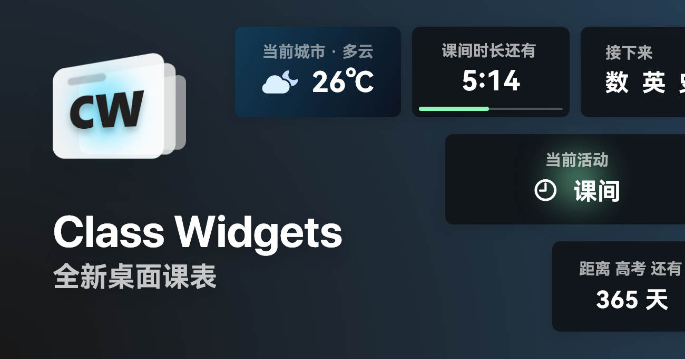
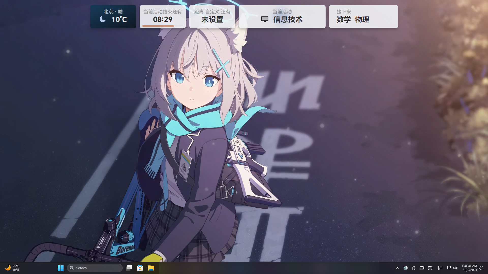
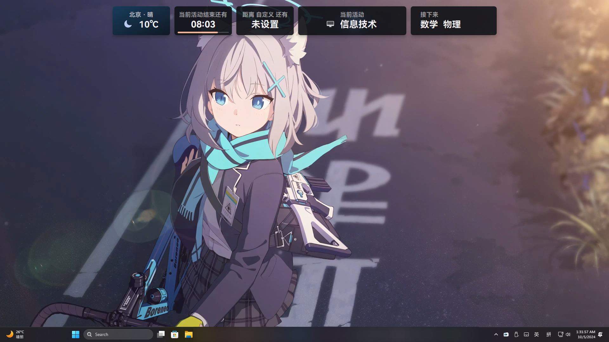

<a href="/README.md">简体中文</a> | English | <a href="/docs/readme/README.ja.md">日本語</a>

  

  <h1 align="center">
  Class Widgets 1
</h1>

  Brand New Desktop Class Schedule

#### [Learn more >](https://www.bilibili.com/video/BV1xwW9eyEGu/)

---

## Features

- **Plugin System** and **Plugin Plaza** written in Python (latest builds)
- Displays today's courses as **widgets**;
- [Class reminders](https://www.yuque.com/rinlit/class-widgets_help/fv2ou1i1ngap0hrl) and prep bell, supports TTS voice out put;
- **High-customization** theme system.
- Simple and intuitive [class schedule editor](https://www.yuque.com/rinlit/class-widgets_help/oozelh8r56tmw0xb);
- Store multiple schedule files and import or export across Class Widgets on different devices;
- Supports [**Course Schedule Exchange Schema** (CSES)](https://github.com/SmartTeachCN/CSES) for conversion between formats;
- [Quick solutions](https://www.yuque.com/rinlit/class-widgets_help/gc4epffu7g5bf9os) for rescheduling or class changes;
- Practical widgets like "Weather", "Custom Countdown", etc;
- [Personalize](https://www.yuque.com/rinlit/class-widgets_help/qyly70ht1ogge1pi) your Class Widgets via "Custom";
- Light or Dark theme support and **auto switch**, and so on.

## Screenshots of the application

#### Main Interface (Light)

#### Main Interface (Dark)

## Installation & Usage

> [!TIP]
> Tutorials available at [Class Widgets Official Documentation](https://www.yuque.com/rinlit/class-widgets_help/gs3gsbms1iivgibm).

> [!IMPORTANT]
> To experience the features on this page, please download Class Widgets from the [**Actions**](https://github.com/Class-Widgets/Class-Widgets/actions) page.

Download the latest zip file from the , extract it to a suitable location, and run `ClassWidgets.exe`.
You can access settings or exit the program via the tray menu.

## License

This project (Class Widgets) is licensed under GPL-3.0. For details, see the [LICENSE](./LICENSE) file.

Copyright © 2025 RinLit.

## Acknowledgments

### Third-Party Libraries and Frameworks

- [PyQt5](https://www.riverbankcomputing.com/static/Docs/PyQt5/)
- [PyQt-Fluent-Widgets](https://github.com/zhiyiYo/PyQt-Fluent-Widgets)
- [Loguru](https://github.com/Delgan/loguru)
- [Requests](https://github.com/psf/requests)

### Assets

- [SF Symbols](https://developer.apple.com/sf-symbols/) (some icons modified)
- [QWeather Icons](https://icons.qweather.com/en/) (some icons modified)
- [Segoe Fluent Icons](https://learn.microsoft.com/en-us/windows/apps/design/style/segoe-fluent-icons-font)（some icons modified）
- [HarmonyOS Sans](https://developer.huawei.com/consumer/en/design/resource/)

### Contributions

[![Ask zread](https://img.shields.io/badge/Ask_Zread-_.svg?style=for-the-badge&color=00b0aa&labelColor=000000&logo=data%3Aimage%2Fsvg%2Bxml%3Bbase64%2CPHN2ZyB3aWR0aD0iMTYiIGhlaWdodD0iMTYiIHZpZXdCb3g9IjAgMCAxNiAxNiIgZmlsbD0ibm9uZSIgeG1sbnM9Imh0dHA6Ly93d3cudzMub3JnLzIwMDAvc3ZnIj4KPHBhdGggZD0iTTQuOTYxNTYgMS42MDAxSDIuMjQxNTZDMS44ODgxIDEuNjAwMSAxLjYwMTU2IDEuODg2NjQgMS42MDE1NiAyLjI0MDFWNC45NjAxQzEuNjAxNTYgNS4zMTM1NiAxLjg4ODEgNS42MDAxIDIuMjQxNTYgNS42MDAxSDQuOTYxNTZDNS4zMTUwMiA1LjYwMDEgNS42MDE1NiA1LjMxMzU2IDUuNjAxNTYgNC45NjAxVjIuMjQwMUM1LjYwMTU2IDEuODg2NjQgNS4zMTUwMiAxLjYwMDEgNC45NjE1NiAxLjYwMDFaIiBmaWxsPSIjZmZmIi8%2BCjxwYXRoIGQ9Ik00Ljk2MTU2IDEwLjM5OTlIMi4yNDE1NkMxLjg4ODEgMTAuMzk5OSAxLjYwMTU2IDEwLjY4NjQgMS42MDE1NiAxMS4wMzk5VjEzLjc1OTlDMS42MDE1NiAxNC4xMTM0IDEuODg4MSAxNC4zOTk5IDIuMjQxNTYgMTQuMzk5OUg0Ljk2MTU2QzUuMzE1MDIgMTQuMzk5OSA1LjYwMTU2IDE0LjExMzQgNS42MDE1NiAxMy43NTk5VjExLjAzOTlDNS42MDE1NiAxMC42ODY0IDUuMzE1MDIgMTAuMzk5OSA0Ljk2MTU2IDEwLjM5OTlaIiBmaWxsPSIjZmZmIi8%2BCjxwYXRoIGQ9Ik0xMy43NTg0IDEuNjAwMUgxMS4wMzg0QzEwLjY4NSAxLjYwMDEgMTAuMzk4NCAxLjg4NjY0IDEwLjM5ODQgMi4yNDAxVjQuOTYwMUMxMC4zOTg0IDUuMzEzNTYgMTAuNjg1IDUuNjAwMSAxMS4wMzg0IDUuNjAwMUgxMy43NTg0QzE0LjExMTkgNS42MDAxIDE0LjM5ODQgNS4zMTM1NiAxNC4zOTg0IDQuOTYwMVYyLjI0MDFDMTQuMzk4NCAxLjg4NjY0IDE0LjExMTkgMS42MDAxIDEzLjc1ODQgMS42MDAxWiIgZmlsbD0iI2ZmZiIvPgo8cGF0aCBkPSJNNCAxMkwxMiA0TDQgMTJaIiBmaWxsPSIjZmZmIi8%2BCjxwYXRoIGQ9Ik00IDEyTDEyIDQiIHN0cm9rZT0iI2ZmZiIgc3Ryb2tlLXdpZHRoPSIxLjUiIHN0cm9rZS1saW5lY2FwPSJyb3VuZCIvPgo8L3N2Zz4K&logoColor=ffffff)](https://zread.ai/Class-Widgets/Class-Widgets) [![Ask DeepWiki](https://img.shields.io/badge/Ask_DeepWiki-blue.svg?style=for-the-badge&logo=data:image/png;base64,iVBORw0KGgoAAAANSUhEUgAAACwAAAAyCAYAAAAnWDnqAAAAAXNSR0IArs4c6QAAA05JREFUaEPtmUtyEzEQhtWTQyQLHNak2AB7ZnyXZMEjXMGeK/AIi+QuHrMnbChYY7MIh8g01fJoopFb0uhhEqqcbWTp06/uv1saEDv4O3n3dV60RfP947Mm9/SQc0ICFQgzfc4CYZoTPAswgSJCCUJUnAAoRHOAUOcATwbmVLWdGoH//PB8mnKqScAhsD0kYP3j/Yt5LPQe2KvcXmGvRHcDnpxfL2zOYJ1mFwrryWTz0advv1Ut4CJgf5uhDuDj5eUcAUoahrdY/56ebRWeraTjMt/00Sh3UDtjgHtQNHwcRGOC98BJEAEymycmYcWwOprTgcB6VZ5JK5TAJ+fXGLBm3FDAmn6oPPjR4rKCAoJCal2eAiQp2x0vxTPB3ALO2CRkwmDy5WohzBDwSEFKRwPbknEggCPB/imwrycgxX2NzoMCHhPkDwqYMr9tRcP5qNrMZHkVnOjRMWwLCcr8ohBVb1OMjxLwGCvjTikrsBOiA6fNyCrm8V1rP93iVPpwaE+gO0SsWmPiXB+jikdf6SizrT5qKasx5j8ABbHpFTx+vFXp9EnYQmLx02h1QTTrl6eDqxLnGjporxl3NL3agEvXdT0WmEost648sQOYAeJS9Q7bfUVoMGnjo4AZdUMQku50McDcMWcBPvr0SzbTAFDfvJqwLzgxwATnCgnp4wDl6Aa+Ax283gghmj+vj7feE2KBBRMW3FzOpLOADl0Isb5587h/U4gGvkt5v60Z1VLG8BhYjbzRwyQZemwAd6cCR5/XFWLYZRIMpX39AR0tjaGGiGzLVyhse5C9RKC6ai42ppWPKiBagOvaYk8lO7DajerabOZP46Lby5wKjw1HCRx7p9sVMOWGzb/vA1hwiWc6jm3MvQDTogQkiqIhJV0nBQBTU+3okKCFDy9WwferkHjtxib7t3xIUQtHxnIwtx4mpg26/HfwVNVDb4oI9RHmx5WGelRVlrtiw43zboCLaxv46AZeB3IlTkwouebTr1y2NjSpHz68WNFjHvupy3q8TFn3Hos2IAk4Ju5dCo8B3wP7VPr/FGaKiG+T+v+TQqIrOqMTL1VdWV1DdmcbO8KXBz6esmYWYKPwDL5b5FA1a0hwapHiom0r/cKaoqr+27/XcrS5UwSMbQAAAABJRU5ErkJggg==)](https://deepwiki.com/Class-Widgets/Class-Widgets)

Thanks to the following comrades for contributing to Class Widgets.

### Sponsors

Thanks to the following for supporting this project:

- [猞猁](http://dq6666.cn/)
- [JerryQAQ](http://hub.rinlit.cn/)

Thanks to the following sponsors for supporting this project.

Free translation platform provided by [Weblate](https://hosted.weblate.org/engage/class-widgets-1/)

#### Translation Status

<table>
  <tr>
    <td>
      
    </td>
    <td>
    Free code signing on Windows provided by <a href="https://signpath.io">SignPath.io</a>, certificate by <a href="https://signpath.org/">SignPath Foundation</a> 
    Windows code signing provided by <a href="https://signpath.io">SignPath.io</a>, certificate by <a href="https://signpath.org">SignPath Foundation</a>
    </td>
  </tr>
</table>

## Code Signing Policy

- Free code signing provided by [SignPath.io](https://about.signpath.io/), certificate by [SignPath Foundation](https://signpath.org/)
- Committers and reviewers: [Organization Members](https://github.com/orgs/Class-Widgets/people)
- Approvers: [Owners](https://github.com/orgs/Class-Widgets/people?query=role%3Aowner)
- This program will not transfer any information to other networked systems unless specifically requested by the user or the person installing or operating it.

## Community

We currently have [Discussions](https://github.com/orgs/Class-Widgets/discussions), a [QQ Group](http://qm.qq.com/cgi-bin/qm/qr?_wv=1027&k=yHXKCAjOxlpTpJ4mNdXm0mxOneYUinRs&authKey=sd3%2F06iGdOZUjkXXPBeIzGnFDIeYwmdwuM8dhk25fi%2B1CUL32MkeN2EEfjdo2pzE&noverify=0&group_code=169200380), and a [Discord server](https://discord.gg/EFF4PpqpqZ).

## Star History

<picture>
   <source media="(prefers-color-scheme: dark)" srcset="https://api.star-history.com/svg?repos=Class-Widgets/Class-Widgets&type=Date&theme=dark" />
   <source media="(prefers-color-scheme: light)" srcset="https://api.star-history.com/svg?repos=Class-Widgets/Class-Widgets&type=Date" />
   
 </picture>

##

This is just my practice project as a newcomer developers, so feedback is deservedly welcome!
